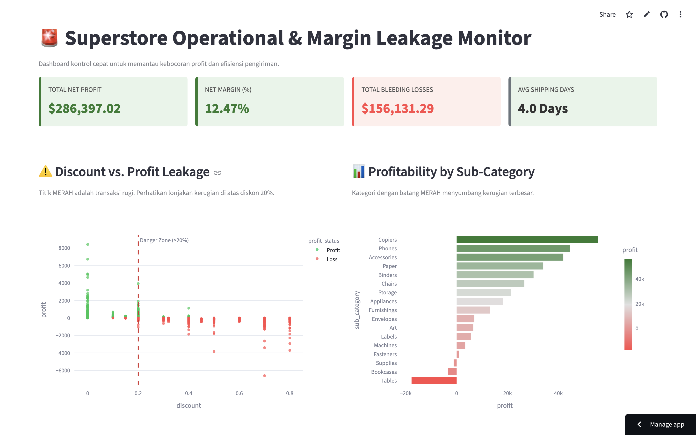
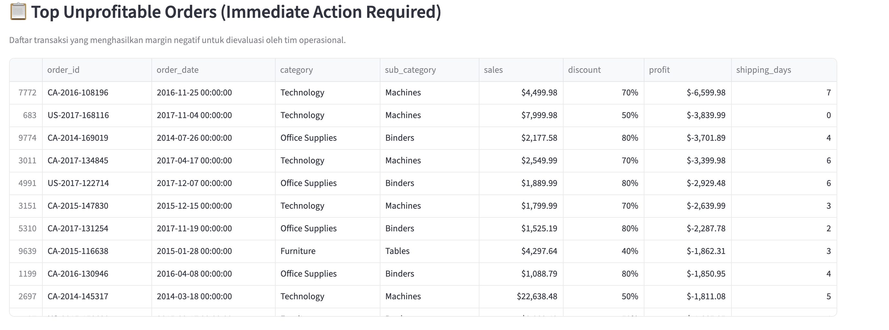
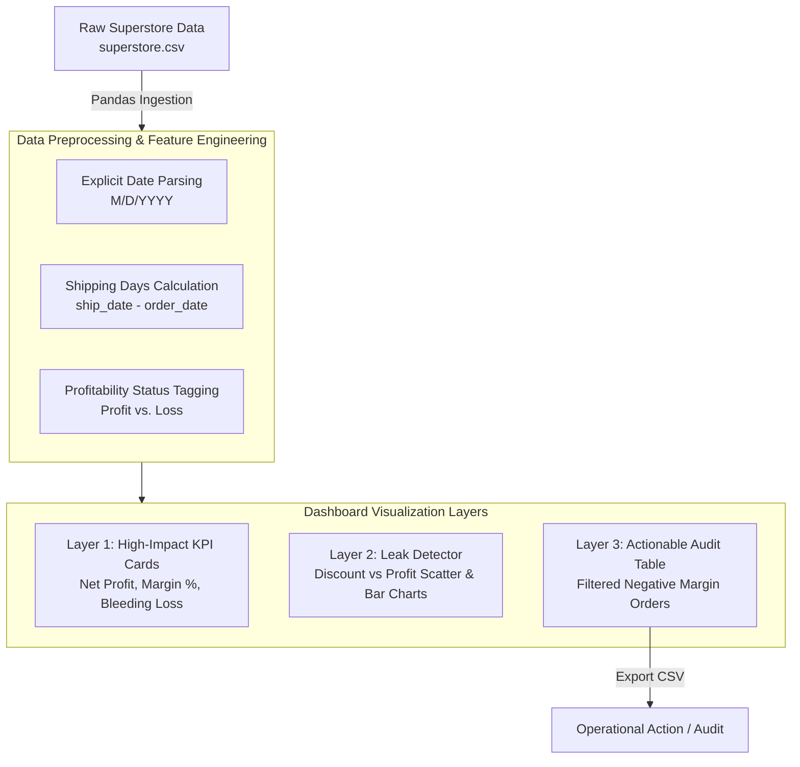

# 🚨 Superstore Margin Leak & Operational Analytics

A specialized operational dashboard designed for **high-volume, thin-margin retail businesses**. Unlike standard dashboards that focus purely on gross sales (*vanity metrics*), this platform identifies **profit leakage**, evaluates **discount thresholds**, and audits **shipping efficiency** in real-time.

---

## 🎯 The Business Problem: The "Thin-Margin" Trap

In fast-paced retail operations like Superstore, high gross revenue often masks critical profit leaks:
- **Uncontrolled Discounting:** Discounts exceeding 20% frequently result in negative net margins.
- **Logistics Bleeding:** High shipping costs on low-value orders erode profits.
- **Hidden Loss Leaders:** Certain sub-categories generate massive sales volume but negative net profit.

This dashboard provides executive and operational teams with an immediate **Loss Leakage Alert Engine** to protect net margins.

## 🖥️ Dashboard Preview

### 1. Executive KPI Cards & High-Level Health

### 2. Leak Detector & Operational Audit

---

## 🔄 System Architecture & Data Flow

---

## 🧠 Visual Psychology & Color Strategy

We utilize high-contrast visual cues to drive immediate decision-making:

| Color | Hex Code | Business Meaning | Target Metric |
| --- | --- | --- | --- |
| **Danger Red** | `#FF4B4B` | **Margin Leak / Loss Zone** | Negative Profit, Discounts > 20%, Unprofitable Orders |
| **Emerald Green** | `#2E7D32` | **Healthy Margin** | Positive Profit, Target Net Margin >= 5% |
| **Amber Warning** | `#FFA000` | **At-Risk Area** | Thin Margins (2% - 4.9%) |
| **Neutral Gray** | `#6C757D` | **Context / Baseline** | Operational Averages, Order Quantities |

---

## 🚀 Key Features

1. **High-Impact Executive Metrics:**
* Real-time **Net Margin (%)** calculation with dynamic color thresholds.
* **Total Bleeding Losses ($):** Quantifies total money lost to unprofitable orders.
* **Average Shipping Days:** Tracks fulfillment velocity.

2. **Visual Leak Detector:**
* **Discount vs. Profit Scatter Plot:** Features a hard threshold line at **20% discount** showing where transactions start losing money.
* **Sub-Category Profitability Bar Chart:** Instantly isolates unprofitable product categories.

3. **Operational Loss Audit Table:**
* Interactive table listing top negative-margin orders.
* Designed for instant review and export by logistics and pricing teams.

